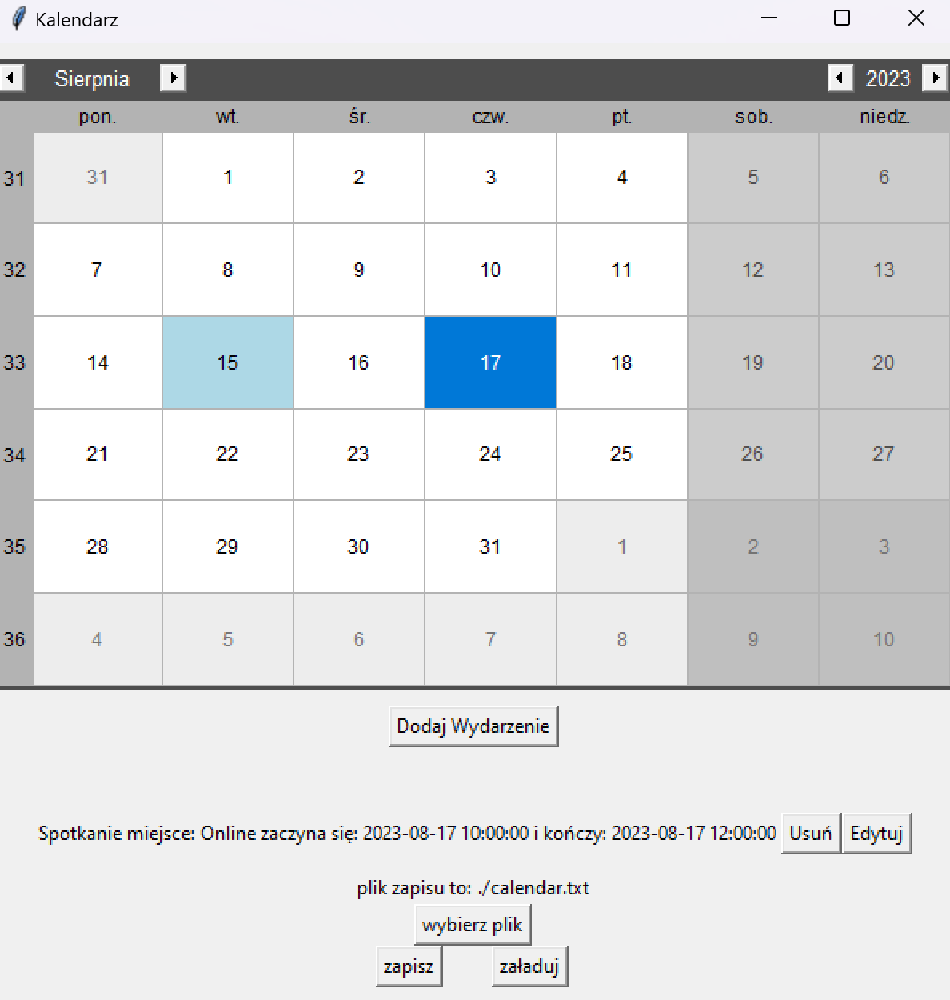

# Kalendarz
## Skład grupy
Nasza grupa projektowa składa się z 4 członków:
- Adam Maciuga
- Dawid Marczyk
- Michał Łazarz
- Wiktor Matykiewicz
## Wytyczne Projektu
Zostało nam przydzielone zadanie numer 1, czyli Kalendarz.
Aplikacja stworzona przez nas powinna mieć następujące funkcjonalności:
1. Dodanie wydarzenie z nazwą, miejscem, czasem.
2. Wypisanie n wydarzeń od daty.
3. Zapis i wczytywanie wydarzeń przy zamknięciu/otwarciu programu.
4. Zapis wydarzeń do pliku pod zadaną ścieżkę.
5. Usuwanie i edytowanie wydarzeń.
6. Jedna zaproponowane przez grupę.( w naszym przypadku jest to baza świąt i innych ogólnych wydarzeń)
## Dokumentajca
### Korzystanie z Aplikacji
Aby uruchonmić stworzoną przez nas aplikację należy:
- posiadać interpreter pythona w wersji 3.10.2 (Prawdopodobnie inne wersje również będą działać, ale nie było to testowane )
- zainstalować package tkcalendar oraz tkTimePicker na przykład przy pomocy komend:
```commandline
  pip install tkcalendar
  pip install tkTimePicker
```
Następnie można przystąpić do uruchomienia programu uruchamiając plik main.py swoim preferowanym programem.
Można również zrobić to z lini komend, należy otowrzyć linie komend w folderze w którym znajduje się plik main.py a następnie wpisać komendę:
```commandline
  python main.py
```
Po toworzeniu aplikacji zobaczymy następujący ekran:

- W lewym górnym rogu widzimy miesąc na który patrzymy, możemy go zmienić strzałkami.
- W prawym górnym rogu widzimy rok no który patrzymy, możemy go zmienić strzałkami.
- Na kolor jasnoniebieski zaznaczone są dni w które dzieją się jakieś wydarzenia.
- Na kolor niebieski zazaczony jest dzień który mamy wybrany.
- Przycisk Dodaj Wydarzenie otworzy formularz który należy wypełnić aby dodać wydarzenie. Data będzie zainicjalizowana jako data wybrana, można ją jednak oczywiście zmienić.
- Jeżeli w danym dniu są jakies wydarzenia, lista tych wydarzeń będzie widoczna pod przyciskiem dodaj wydarzenie.
- Przycisk Usuń usunie wydarzenie.
- Natomiast przycisk Edytuj otworzy formularz który będzie zainicjalizowany na obecne wartośći, należy je zmienić i klikąć zapisz.
- Prycisk Wybierz plik otworzy eksplorator plików w celu wybrania nowgo pliku do zapisu / ładowania kalendarza.
- Przycisk Zapisz zapisze aktualne zmiany w wybranym pliku, a załaduj załaduje z niego informacje.
- Aplikacja automatycznie wczyta plik przy otwarciu i zapisze do niego zmiany przy zamknięciu.
### Architektura Aplikacji
Nasza Aplikacja została stworzona w sposób obiektowy.
Stworzyliśmy następujące klasy zawierające następujące metody i atrybuty:
- Calendar - Główna klasa przechowująca wszystkie informacje o wydarzeniach
  - path - ścieżka do zapisu danych pomiędzy otwarciami programu
  - name - nazwa kalendarza
  - activities - lista wydarzeń zapisanych w kalendarzu
  - add_activity(activity) - dodaje wydarzenie do kalendarza
  - remove_activity(activity) - usuwa wydarzenie z kalendarza
  - change_activity_$warość$(activity, nowa wartośc) - grupa funkcji edytujące instejące wydarzenie
  - get_activites_from_range(start, end, only_inclusion=False) - funkcja pobierająca wszystkie wydarzenie z zadanego przedziału, gdy parametr only_inclusion ma wartość True funkcja zwraca tylko wydarzenia które całkowicie mieszczą się w zadanym przedziale, w przeciwnym razie funkcja zwraca również wydarzenia które mają tylko swoją częśc w tym przedziale  
- Activity - Klasa odpowiadająca za przechowywanie danych o poszczególnych wydarzeniach
  - name - nazwa wydarzenia
  - place - miejsce wydarzenia
  - start_date, edn_date - daty początku i końca wydarzenia
- Settings - Klasa odpowidzialna za przechowywanie ustawień

Do Wyświetlania danych na ekranie użyliśmy packageów tkinter, tkcalendar oraz tkTimePicker.
Pozwoliły one na dośc proste stworzenie GUI, które jest kluczowym elementem aplikacji.

## Podział Pracy i Użyte Technologie 
W celu przydziału zadań skorzystaliśmy z Github Projects.
Konwersacje na temat projektu prowadziliśmy przez grupę na Messengerze.
Jako system kontroli wersji zastosowaliśmy git ze zdalnym repozytorium na Githubie.

Praca została podzielona na podzadania, które zostały wykonane przez następujące osoby:
- Adam Maciuga
  - Stworzenie podstawowej funkcjonalności bez GUI
  - Pamięć pomiędzy otwarciami programu
  - Możliwość zapisu i wczytania danych z pliku wybranego przez użytkownika
  - Zrobienie UI Wydarzeń 
  - dopracowanie UI dodawania wydarzeń
  - dopracowanie UI edycji i usuwania wydarzeń
  - UI możliwości wybrania pliku do zapisu
  - Testy Jednostkowe
  - Stworzenie i ustawienie repozytorium, github projects i opisu projektu
- Dawid Marczyk
    - Stworzenie UI pustego kalendarza
    - Podstawowe UI dodawania i edycji wydarzeń
- Michał Łazarz
    - Stworzenie UI pustego kalendarza
    - Podstawowe UI dodawania i edycji wydarzeń
- Wiktor Matykiewicz
    - Edycja i Usuwanie wydarzeń
    - Automatyczne dodawanie świąt

Pracując z githubem nasz główny branch był chroniony, nie można było commitować bezpośrednio.
Pull requesty do tego brancha musiały zostać zaakceptowane przez co najmniej dwóch członków zespołu.
Dzięki temu wszyscy byli zaznajomieni z projektem, a szansa żeby błędy przedostały się do głównego brancha była mniejsza,
ponieważ kod był sprawdzany przez kilka osób.
